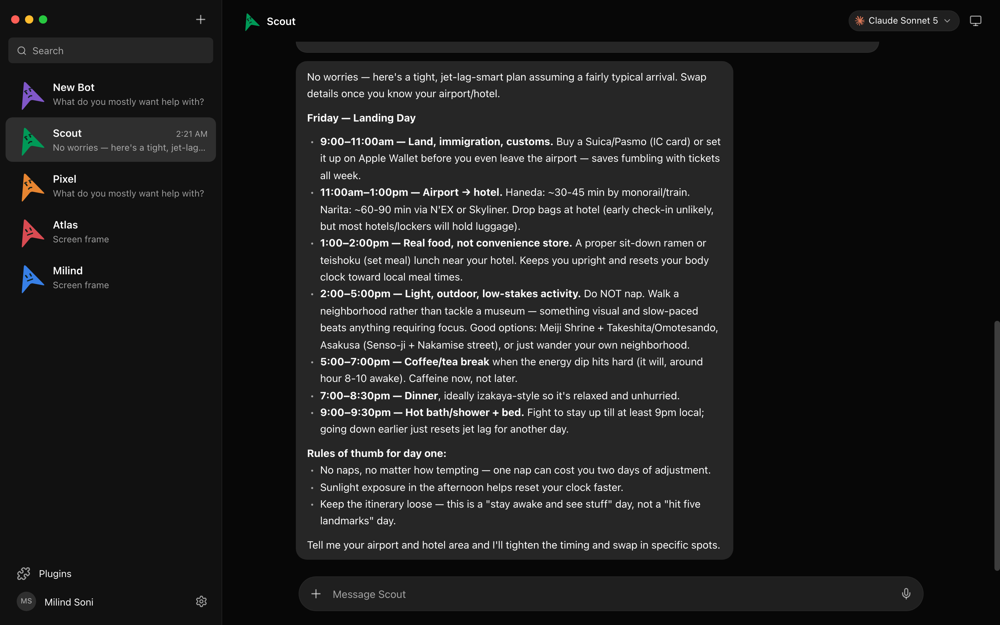
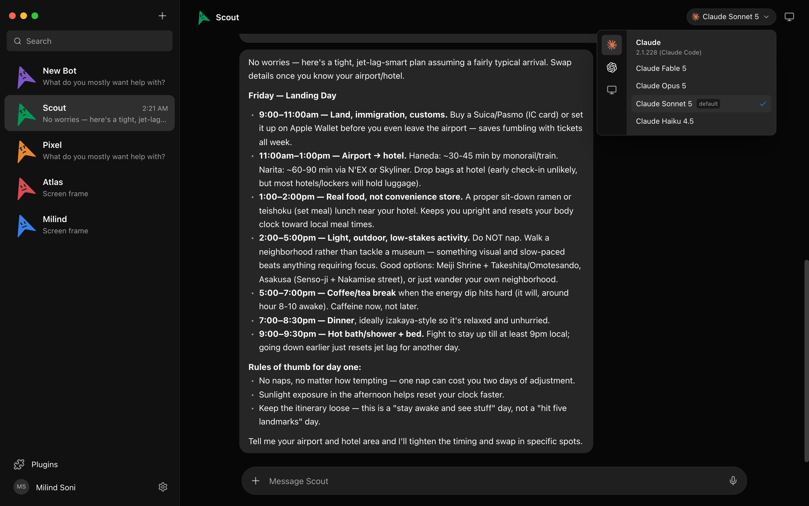
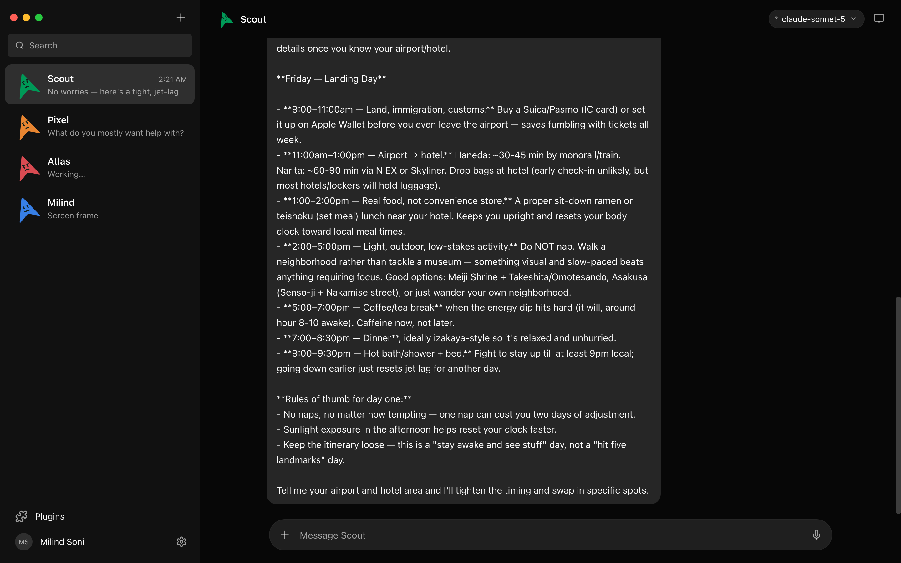
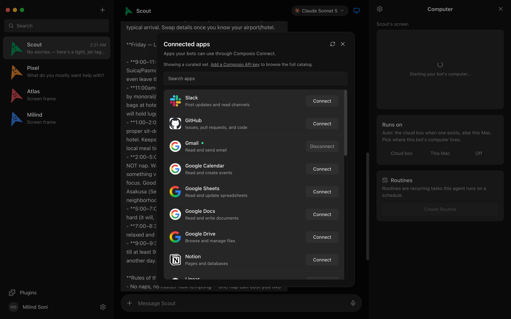
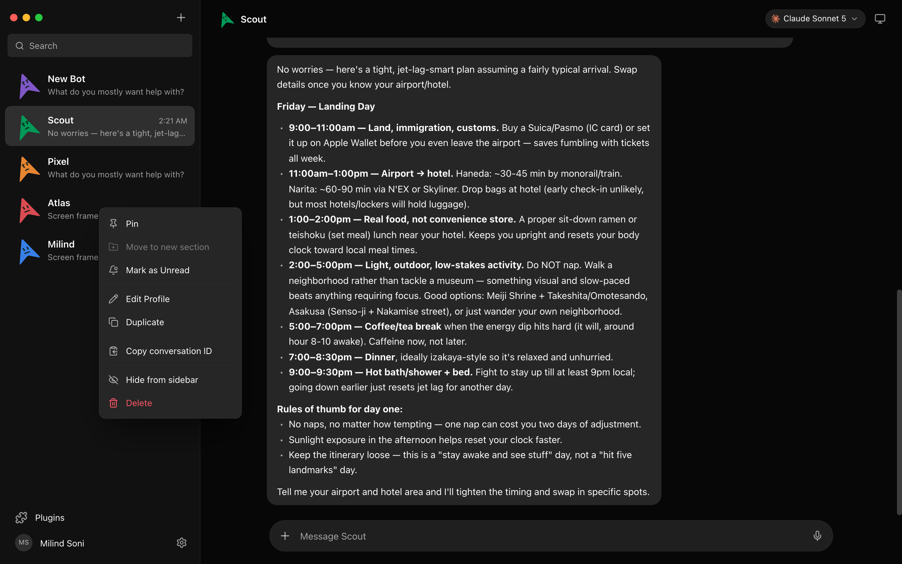
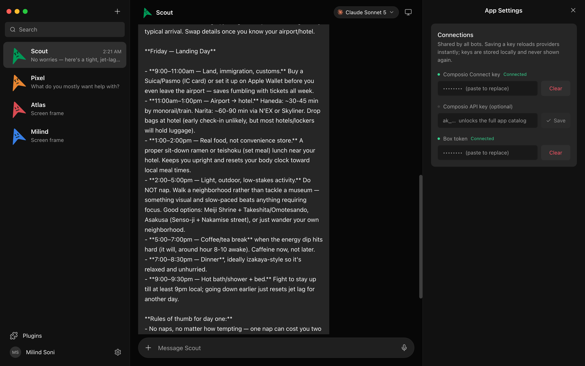
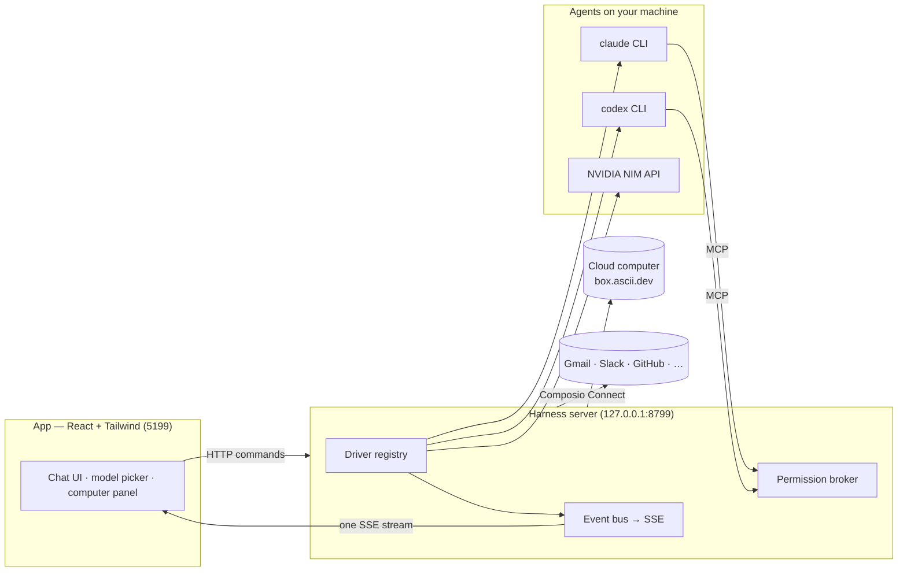

> ⚠️ **No affiliation with any cryptocurrency.** OpenMausBotV2 has no token. Any coin using the OpenMausBot, Maus, or SupaMaus name is not created, endorsed, or affiliated with this project or its maintainers. No tokens, payments, or allocations have been received by anyone involved, and none will be endorsed.

<div align="center">

# OpenMausBotV2

**Your own team of AI bots, in a chat app.**

<sub>An open-source take on **Grok Bot** — bring-your-own-agent, local-first, on the models you already have.</sub>

Every bot in the sidebar is a real agent — Claude, Codex, or Grok running locally under the hood, or any of the open-source LLMs served by NVIDIA NIM in the cloud — with its own
personality, its own model, its own cloud computer, and its own connected apps.
Talk to them like contacts. Watch them work. Approve what matters.


<br>
<br>



</div>

---

## Why

One assistant in one box is the wrong shape for agents. OpenMausBotV2 keeps the idea (AI as a *messaging app*: a roster of bots you chat with, each with its own personality, memory of its thread, model, computer, and apps) and rebuilds it open, local-first, and on the agents you already have:

- **Bring your own agents.** Bots run on the `claude`, `codex`, and `grok` CLIs installed on your own machine — your existing logins and subscriptions, no new accounts, no proxy in the middle.
- **Or bring your own key.** The **NVIDIA** driver turns a single NVIDIA API key into ~90+ open-source chat models — Llama, Nemotron, DeepSeek, GPT-OSS, GLM, Kimi, Qwen, Mistral, Gemma and more — with the model list discovered live from NVIDIA's API, so new models appear automatically.
- **Local first.** One small harness server on `127.0.0.1` owns every agent process. Transcripts, keys, and events live in `~/.openmausbot`, not a cloud.
- **Agents with hands.** Each bot can get a real computer — a cloud Linux desktop it drives while you watch live, or your own machine — plus 500+ apps through Composio Connect.

## Features

<table>
<tr>
<td width="50%" valign="top">

### 🧠 Pick a brain per bot

A model picker with a provider rail — Claude, Codex, Grok, and NVIDIA cloud models side by side, defaults marked, unavailable providers dimmed with the reason. Switch a bot's model mid-conversation.



</td>
<td width="50%" valign="top">

### 🖥️ Every bot gets a computer

Open the Computer panel and the bot's cloud desktop spins up on its own — live screen preview while it works, "Open desktop" to take over in your browser, or point the bot at *your* machine instead.


</td>
</tr>
<tr>
<td width="50%" valign="top">

### 🙋 Bots ask before they act

Shell commands, file edits, and questions surface as inline cards — Allow / Deny / answer in chat. A permission broker turns every risky action into a decision you make, for cloud and local computers alike.



</td>
<td width="50%" valign="top">

### 🔌 Connected apps

A one-click marketplace over Composio Connect: Gmail, Slack, GitHub, Notion, Linear and hundreds more. OAuth once, and every bot can use them as tools.



</td>
</tr>
<tr>
<td width="50%" valign="top">

### 🗂 Manage bots like chats

Right-click any bot: pin, mark unread, edit profile, duplicate, copy conversation ID, hide, delete. It's a messaging app — your agents behave like contacts.



</td>
<td width="50%" valign="top">

### 🔑 Keys once, everything lights up

Paste credentials in App Settings — they persist locally and the provider fleet hot-reloads instantly. Secrets are write-only: the UI only ever sees "configured" flags.



</td>
</tr>
</table>

**Also in the box:** streaming replies with tool-run activity chips · native macOS dictation from the composer mic (on-device Apple speech recognition — desktop app) · SupaMaus cursor mascots with role-aware expressions · screenshots of the bot's work folded into the transcript.

## Providers

| Provider | Source | Models | How you get in |
|---|---|---|---|
| **NVIDIA NIM** | Cloud API (`integrate.api.nvidia.com`) | Llama 3.x, Llama 3.3 Nemotron Super/Ultra, Nemotron 3, GPT-OSS, DeepSeek V4, GLM, Kimi, Qwen, Mistral, Gemma, Mixtral, MiniMax + more | Paste your NVIDIA API key (`nvapi-…`) in App Settings — the full model list is fetched live from NVIDIA's `/v1/models` and refreshed every 10 minutes |
| **Claude** | Local `claude` CLI | All Claude models | `claude` installed & logged in |
| **Codex** | Local `codex` CLI | All Codex models | `codex` installed & logged in |
| **Grok** | Local `grok` CLI | Grok models | `grok` installed & logged in |
| **Cloud computer** | box.ascii.dev | – | Box token pasted in App Settings |

The NVIDIA driver (in `server/drivers/nvidia.ts`) auto-discovers the model catalog from the API instead of hardcoding it, filters out non-chat endpoints (embeddings, rerankers, TTS/ASR, image generation, guard/classifier models), and surfaces the API's exact error message — including a hint pointing at build.nvidia.com — whenever a model call fails.

## How it works

Two processes. The app holds no transports of its own — it sends typed commands over HTTP and folds one SSE event stream into state. The harness server owns every agent process and normalizes each provider's native protocol into one canonical runtime event stream (logged per-thread as NDJSON).



| Layer | Where | What it does |
|---|---|---|
| Drivers | `server/drivers/` | One per provider: Claude, Codex, and Grok over their local CLIs (stream-JSON / JSON-RPC / ACP), NVIDIA NIM over the OpenAI-compatible API, plus a cloud-computer agent. Unknown drivers degrade to "unavailable", never crash the fleet. |
| Harness | `server/harness/` | Registry (configs → live instances) and the fan-in event bus every client folds. |
| API | `server/index.ts` | Bots, turns, approvals, model catalog, computer lifecycle, connectors, config — HTTP + SSE. |
| App | `src/` | The chat shell. Server-backed store, one reducer, zero client-side transports. |
| Desktop | `electron/` | macOS + Windows shells: dictation helper (SFSpeechRecognizer, macOS only), local screen capture, CUA bridge (macOS only). |

## Quick start

**From source:**

```sh
git clone https://github.com/harmanhanjra/OpenMausBotV2 && cd OpenMausBotV2
pnpm install

pnpm dev:server    # harness server → 127.0.0.1:8799
pnpm dev           # app → http://127.0.0.1:5199
pnpm dev:desktop   # or the Electron shell
```

Requirements: **macOS or Windows**, **Node 24+**, **pnpm**, and at least one agent CLI — [`claude`](https://claude.com/claude-code), [`codex`](https://github.com/openai/codex), or [`grok`](https://x.ai/cli) — installed and logged in. They appear in the model picker automatically.

Optional, pasted once in **App Settings** (gear in the sidebar footer):

| Key | Unlocks |
|---|---|
| **NVIDIA API key** (`nvapi-…`, from [build.nvidia.com](https://build.nvidia.com) or [NGC](https://ngc.nvidia.com)) | ~90+ open-source chat models on NVIDIA NIM — no local GPU needed |
| Composio Connect key (`ck_…`) | The connected-apps marketplace |
| Composio API key (`ak_…`) | The full 500+ app catalog with official logos |
| Box token ([box.ascii.dev](https://box.ascii.dev)) | Cloud computers for your bots |

```sh
pnpm typecheck     # app + server
pnpm build         # typecheck + production build
pnpm test          # vitest suite (driver tests incl. NVIDIA model discovery)
pnpm package:win   # Windows installer + zip → release/
```

## Status

Early but real — the loop works end to end: message → agent → streamed reply → tools → approvals → computer use. Rough edges to expect: routines (scheduled tasks) are a placeholder, sidebar sections aren't built yet, and the Linux shell hasn't been attempted (macOS and Windows both run end to end; the harness itself is portable Node).

Contributions welcome — the driver SPI in [`server/contracts.ts`](server/contracts.ts) is deliberately small; adding a provider is one file in [`server/drivers/`](server/drivers/) plus a one-line registration.

## Credits & upstream

OpenMausBotV2 is a fork of **[OpenMausBot](https://github.com/milind-soni/OpenMausBot)**, an independent open-source project inspired by Grok Bot. It is not affiliated with, endorsed by, or associated with xAI; "Grok" is a trademark of its respective owner. V2 adds the NVIDIA NIM cloud-model provider, live model discovery, and a refreshed open-source packaging.

## License

[MIT](LICENSE) © 2026 Milind Soni, OpenMausBot contributors, and the OpenMausBotV2 maintainers.
